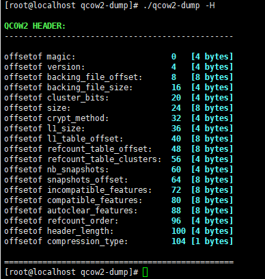
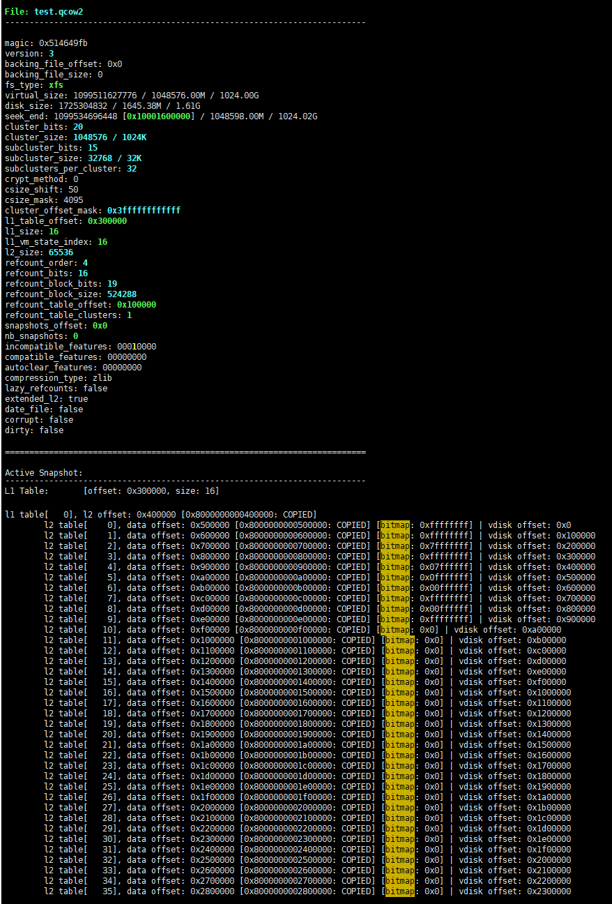

## YOUPLUS's tools

## qcow2-dump
=========================================================================

## qcow2镜像检测与修复

## 个人简介

## qcow2-dump实现框架

## version

Copyright (c) 2016-2024 YOUPLUS

Author: YOUPLUS(<zhang_youjia@126.com>)

qcow2-dump is a useful tool for checking and repairing damaged qcow2 image, it has some improvements compare with qemu-img check command (qcow2-dump has all functions which qemu-img check command has).

<pre>
what's error?        (type of error)
where's error?       (posistion of error)
Can it be repaired?
How to repair it?    (repairing advice)
</pre>

## Usage
`qcow2-dump [opts] <qcow2_image>`

<pre>
qcow2-dump -h

Usage: qcow2-dump [-l] [-f] [-m info|check|error|dump] [-o refcount|snapshot|all] [-s active|inactive|all|id/name] filename

-h | --help
-v | --version
-H | --header
-K | --dmesg
-l | --lock
-f | --flags
-b | --base
-c | --compress
-M | --mark     corrupt|dirty
-C | --clean    corrupt|dirty
-V | --value    dec/hex value
-O | --offset   dec/hex offset
-S | --src      dec/hex offset
-F | --file     source of -m copy
-w | --width    1/2/4/8/... byte(s)
-A | --apply    snapshot[N]|snapshot id/name
-D | --delete   snapshot[N]|snapshot id/name
-E | --exclude  snapshot[N]|snapshot id/name
-d | --display  off|color [default: color]
-o | --output   refcount|snapshot|all [default: all]
-s | --snapshot active|inactive|all|id/name [default: all]
-R | --repair   off|check|leak|error|reuse|discard|all [default: check]
-m | --mode     info|check|error|dump|edit|copy|rebase [default: check]

[SAFE OPERATION]:
eg: qcow2-dump -m info filename

eg: qcow2-dump [-m check] [-K] filename
eg: qcow2-dump [-m check] [-K] -c filename
eg: qcow2-dump [-m check] [-K] -l filename

eg: qcow2-dump -m error [-K] filename
eg: qcow2-dump -m error [-K] -c filename
eg: qcow2-dump -m error [-K] -l filename

eg: qcow2-dump -m dump  [-K] filename > /var/dump.log
eg: qcow2-dump -m dump  [-K] -c filename > /var/dump.log
eg: qcow2-dump -m dump  [-K] -f filename > /var/dump.log
eg: qcow2-dump -m dump  [-K] -l filename > /var/dump.log

[DANGEROUS OPERATION]:
eg: qcow2-dump -A snapshot id/name filename
eg: qcow2-dump -A snapshot[N] filename
eg: qcow2-dump -D snapshot id/name filename
eg: qcow2-dump -D snapshot[N] filename
eg: qcow2-dump -D all filename
eg: qcow2-dump -E snapshot id/name filename
eg: qcow2-dump -E snapshot[N] filename
eg: qcow2-dump -E 0 filename

eg: qcow2-dump -R leak|error|reuse|discard|all filename

eg: qcow2-dump -m rebase -F backing_file [-b] filename

eg: qcow2-dump -m edit -O offset -V value [-w 8] filename
eg: qcow2-dump -m edit -O offset -V value -w 1/2/4/8 filename

eg: qcow2-dump -m copy -O offset -S offset -w length filename
eg: qcow2-dump -m copy -O offset -S offset -w length [-F source] filename

eg: qcow2-dump -C corrupt filename
eg: qcow2-dump -M corrupt filename

[EXAMPLES]:
eg: qcow2-dump [-m check] filename > /dev/null; echo $?
eg: qcow2-dump [-m check] -d none filename > /var/check.log
eg: qcow2-dump -m error filename > /var/error.log
eg: qcow2-dump -m error -R none filename > /var/error.log
eg: qcow2-dump -m error -o refcount filename > /var/refcount.log
eg: qcow2-dump -m error -o snapshot filename > /var/snapshot.log
eg: qcow2-dump -m error -s active filename > /var/active.log
eg: qcow2-dump -m error -s inactive filename > /var/inactive.log
eg: qcow2-dump -m dump  -o refcount filename > /var/refcount.log
eg: qcow2-dump -m dump  -o snapshot filename > /var/snapshot.log
eg: qcow2-dump -m dump  -o snapshot -s active filename > /var/active.log
eg: qcow2-dump -m dump  -o snapshot -s 1 filename > /var/snapshot1.log
eg: qcow2-dump -m dump  -o snapshot -s inactive filename > /var/inactive.log
eg: qcow2-dump -m dump  -f -o snapshot -s active filename > /var/active.log
</pre>

## Help

## Header

## Qcow2 Layout
.png)

## Discussion Email

## Examples
<pre>
qcow2-dump filename
</pre>

<pre>
qcow2-dump -m error filename
</pre>

<pre>
qcow2-dump -R all filename
</pre>

## Subcluster

## Subcluster Bitmap

